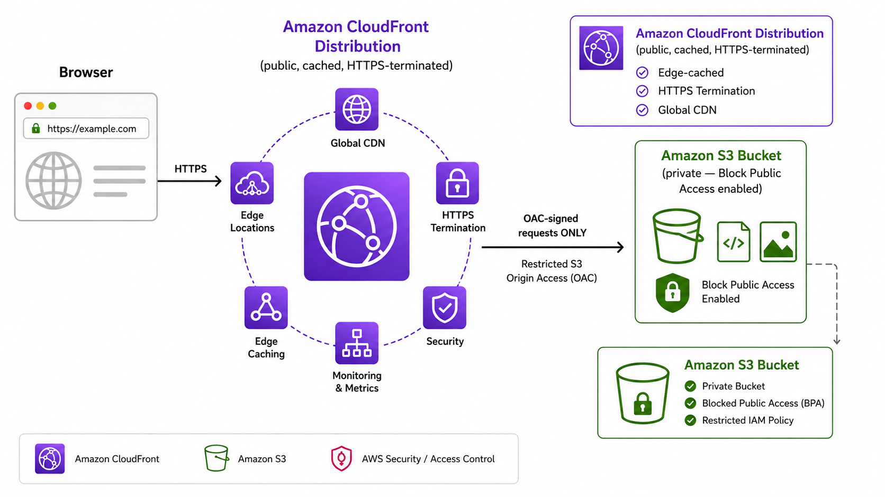

# Project 1 — Static Site Hosting with S3 + CloudFront

Infrastructure-as-code project deploying a static website using **AWS CloudFormation**.
Files sit in a private S3 bucket and are served globally via a **CloudFront** CDN,
secured with **Origin Access Control (OAC)** so the bucket itself is never publicly exposed.

## Architecture

```
   Browser
      │  HTTPS
      ▼
CloudFront Distribution  (public, cached, HTTPS-terminated)
      │  OAC-signed requests only
      ▼
   S3 Bucket (private — Block Public Access enabled)
```
## Architecture



## Stack contents (`template.yaml`)

| Resource | Purpose |
|---|---|
| `SiteBucket` | Private S3 bucket, all public access blocked |
| `SiteOAC` | Origin Access Control — lets CloudFront authenticate to the bucket |
| `SiteDistribution` | CloudFront CDN — public HTTPS endpoint, global edge caching |
| `SiteBucketPolicy` | Grants read access to *only* this specific CloudFront distribution |

## Deploy

**1. Validate the template**
```bash
aws cloudformation validate-template --template-body file://template.yaml
```

**2. Create the stack**
```bash
aws cloudformation create-stack \
  --stack-name project1-static-site \
  --template-body file://template.yaml \
  --parameters ParameterKey=BucketNamePrefix,ParameterValue=your-name-portfolio
```

**3. Wait for it to finish** (takes a few minutes — CloudFront distributions are slow to provision)
```bash
aws cloudformation wait stack-create-complete --stack-name project1-static-site
```

**4. Get your outputs** (bucket name + live URL)
```bash
aws cloudformation describe-stacks \
  --stack-name project1-static-site \
  --query "Stacks[0].Outputs"
```

**5. Upload your site files**
```bash
aws s3 sync ./site s3://<BucketName-from-step-4>
```

**6. Visit your live site**
Open the `CloudFrontURL` value from step 4 in your browser. It looks like:
`https://d1234abcdxyz.cloudfront.net`

> Note: on first deploy, CloudFront can take 5–15 minutes to fully propagate to all edge locations. If you get an error immediately after deploy, wait a few minutes and retry.

## Updating the site later

Whenever you change files in `/site`, re-sync and invalidate the CloudFront cache so viewers see the new version immediately:

```bash
aws s3 sync ./site s3://<BucketName> --delete
aws cloudfront create-invalidation --distribution-id <DistributionId> --paths "/*"
```

## Tear down (avoid ongoing charges)

```bash
aws s3 rm s3://<BucketName> --recursive
aws cloudformation delete-stack --stack-name project1-static-site
```

## Cost

Free tier covers this comfortably for a portfolio site: S3 storage is fractions of a cent,
CloudFront's free tier includes 1TB/month data transfer out and 10M requests for the first year.
Realistic cost for a low-traffic portfolio site after free tier: **under $1/month**.

## What this project demonstrates

- Infrastructure as Code with CloudFormation
- Secure S3 bucket configuration (no public buckets)
- CDN configuration with CloudFront
- Origin Access Control (the current AWS-recommended pattern, not the deprecated OAI)
- IAM-scoped resource policies (least privilege — one distribution, one bucket)
